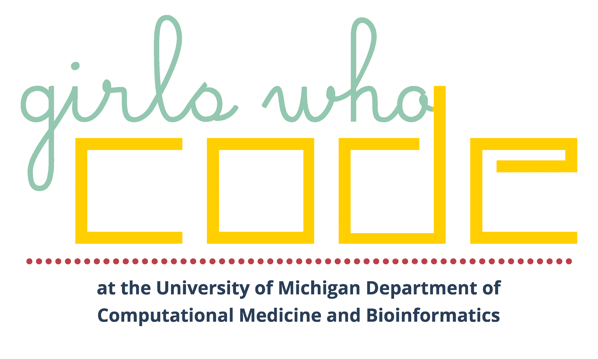

# GWC-DCMB



A meta-repository to help navigate the repos and resources of
[Girls Who Code at UM-DCMB](http://umich.edu/~girlswc/).

## About Us

Founded by current doctoral students in the
[Department of Computational Medicine and Bioinformatics (DCMB)](https://medicine.umich.edu/dept/computational-medicine-bioinformatics)
at the University of Michigan, our Girls Who Code club seeks to provide a
collaborative and supportive environment for high school women of all skill levels
and backgrounds interested in learning how to code.

Due to the research expertise of our graduate student Facilitators, our club
curriculum is focused on computational data analysis and the Python programming
language. Participants learn core coding concepts and implement their new skills
in a data science capstone project of their choosing.

## Resources

| Repository | Description | Language(s) |
|---|---|---|
| [ClubCurriculum](https://github.com/GWC-DCMB/ClubCurriculum) | Curriculum for our weekly club for high school students. |  |
| [SummerExperience](https://github.com/GWC-DCMB/SummerExperience) | Curriculum for our week-long Data Science Summer Experience. |  |
| [CapstoneProject](https://github.com/GWC-DCMB/CapstoneProject) | Capstone Project datasets & instructions. | Jupyter Notebook, Python |
| [challengeQuestions](https://github.com/GWC-DCMB/challengeQuestions) | Jupyter notebooks of challenge questions for learners. | Jupyter Notebook, Python, Shell |
| [codeDemos](https://github.com/GWC-DCMB/codeDemos) | Stand-alone Python coding demos. | Jupyter Notebook, Python |
| [FEMMES](https://github.com/GWC-DCMB/FEMMES) | Resources for activities for U-M FEMMES. |  |
| [ozobotLessons](https://github.com/GWC-DCMB/ozobotLessons) | Lesson plans for Ozobots. |  |
| [curriculum-notebooks](https://github.com/GWC-DCMB/curriculum-notebooks) | Jupyter notebooks for our Summer Experience and Club Curriculum. | Jupyter Notebook, Shell, Python |
| [GWC-DCMB](https://github.com/GWC-DCMB/GWC-DCMB) | A meta-repository to help navigate our repos and resources. | Python, Shell |

### Additional Resources

- For contributors, instructors, & facilitators
    - [How to contribute to our curriculum](CONTRIBUTING.md)
    - [Lesson guidelines for accessibility](writing-accessible-lessons.md)
    - [Live coding tips](live-coding-tips.md)
    - [Facilitator best practices](facilitator-best-practices.md)
    - [Resources for online teaching](online-teaching.md)
    - [Notebook keys](keys.md)
- For learners
    - [How to get started](get-started.md)
    - [Troubleshooting checklist](troubleshooting-checklist.md)
    - [Functions, Methods, Packages](functions_methods_packages.md)
    - [Resources for learners](learning-resources.md)
- For everyone
    - [Debugging the Gender Gap](debugging-the-gender-gap.md)
    - [Our Anti-Racism Statement](anti-racism.md)


## Get Involved

Are you a UMich student, post-doc, faculty, or other member of the
University of Michigan community? Join our
[mailing list](https://mcommunity.umich.edu/#group:Bioinformatics%20Girls%20Who%20Code)
or [send us an email](mailto:gwc.bioinfo-requests@umich.edu) to find out
how you can get involved!

Are you a high school student or younger looking to learn with us?
[Send us an email](mailto:gwc.bioinfo-requests@umich.edu)
and stay tuned to [our website](http://umich.edu/~girlswc)
for announcements on our next recruiting cycle.

## License

All materials hosted here are subject to the licenses described in the [LICENSE file](LICENSE.md).

## Citation

The paper describing our curriculum and the development
process is out in JOSE! If you would like to cite our work,
please use:


> Duda & Sovacool et al., (2021). Teaching Python for Data Science: Collaborative development
> of a modular & interactive curriculum. Journal of Open Source Education, 
> 4(46), 138, https://doi.org/10.21105/jose.00138


A bibtex entry for LaTeX users:

```
@article{duda_teaching_2021,
  doi = {10.21105/jose.00138},
  url = {https://doi.org/10.21105/jose.00138},
  year = {2021},
  publisher = {The Open Journal},
  volume = {4},
  number = {46},
  pages = {138},
  author = {Marlena Duda and Kelly Sovacool and Negar Farzaneh and Vy Nguyen and Sarah Haynes and Hayley Falk and Katherine Furman and Logan Walker and Rucheng Diao and Morgan Oneka and Audrey Drotos and Alana Woloshin and Gabrielle Dotson and April Kriebel and Lucy Meng and Stephanie Thiede and Zena Lapp and Brooke Wolford},
  title = {Teaching Python for Data Science: Collaborative development of a modular & interactive curriculum},
  journal = {Journal of Open Source Education}
}
```
